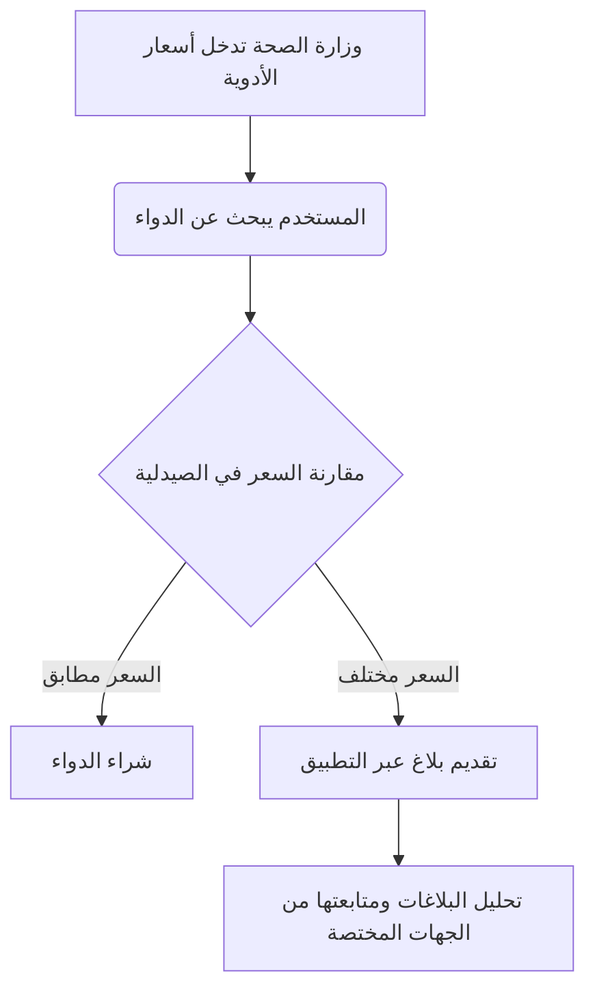

  <h1>PharmGov — فارم جوف</h1>

  

  

  
<b>نظام رقابي مركزي حكومي لضبط وتنظيم أسعار الأدوية وربطها بالصيدليات تحت إشراف جهة صحية.</b>

  
<b>A centralized government regulatory system to control and organize medicine prices and link them to pharmacies under the supervision of a health authority.</b>

---

##  نظرة عامة | Overview

تطبيق **PharmGov** هو تطبيق أندرويد يتيح للمواطن التحقق من السعر الرسمي لأي دواء معتمد من وزارة الصحة، ومقارنته بالسعر المعروض في الصيدلية. كما يوفر التطبيق إمكانية الإبلاغ عن المخالفات السعرية، والبحث عن توفر الأدوية في الصيدليات القريبة، مما يعزز الشفافية والرقابة المجتمعية.

**PharmGov** is an Android application that allows citizens to verify the official price of any medicine approved by the Ministry of Health and compare it with the price offered at the pharmacy. The app also provides the ability to report price violations and search for medicine availability in nearby pharmacies, thereby enhancing transparency and community oversight.

## 🎯 الأهداف | Objectives

يهدف مشروع PharmGov إلى تحقيق مجموعة من الأهداف الاستراتيجية لضبط سوق الأدوية:

| الهدف  | Objective  |
| :--- | :--- |
| منع التلاعب بأسعار الأدوية | Prevent manipulation of medicine prices |
| توحيد السعر الرسمي بين الصيدليات | Standardize the official price across pharmacies |
| تمكين المواطن من التحقق والبلاغ | Empower citizens to verify and report |
| توفير قاعدة بيانات محدثة للأدوية وأسعارها | Provide an updated database of medicines and their prices |

## ✨ الوظائف الأساسية | Core Features

### 1. التحقق من السعر | Price Verification
يتيح النظام للمستخدمين البحث عن الدواء بالاسم وعرض تفاصيل التسعيرة الرسمية.
*   **السعر الرسمي:** السعر المعتمد من وزارة الصحة.
*   **نسبة الربح المعتمدة:** هامش الربح المسموح به للصيدلية.
*   **السعر النهائي للمستهلك:** السعر الذي يجب أن يدفعه المواطن.

### 2. الإبلاغ عن مخالفة | Reporting Violations
نموذج متكامل لتقديم بلاغات عن المخالفات السعرية، يتضمن:
*   المحافظة والمديرية.
*   اسم الصيدلية واسم الدواء.
*   السعر المعروض في الصيدلية.
*   إمكانية إرفاق صورة الفاتورة (اختياري).

### 3. البحث عن صيدلية | Pharmacy Search
محرك بحث مخصص للصيدليات يتيح:
*   البحث بالاسم.
*   عرض بيانات الصيدلية التفصيلية.
*   عرض حالة التزام الصيدلية بالأسعار الرسمية.

### 4. توفر الدواء | Medicine Availability
ميزة للبحث عن الأدوية وتحديد أماكن توفرها:
*   البحث عن دواء محدد.
*   عرض الصيدليات القريبة التي يتوفر لديها الدواء.
*   تحديد الموقع الجغرافي للصيدليات على الخريطة.

##  هيكلية التطبيق | Application Structure

يتكون التطبيق من عدة شاشات رئيسية لتسهيل تجربة المستخدم:

| الشاشة | الوصف |
| :--- | :--- |
| **Home Screen** | واجهة البحث السريع عن الأدوية. |
| **Medicine Details** | عرض تفاصيل السعر الرسمي للدواء. |
| **Report Screen** | نموذج إرسال البلاغات عن المخالفات. |
| **Pharmacy Search** | واجهة البحث عن الصيدليات وتقييمها. |
| **Nearby Availability** | خريطة عرض توفر الدواء في الصيدليات القريبة. |
| **Admin Panel** | لوحة تحكم خارجية لإدارة الأسعار والصيدليات من قبل الجهات المختصة. |

##  آلية العمل | Workflow

تعتمد آلية عمل النظام على التكامل بين الجهات الصحية والمواطنين:

## 🛠️ التقنيات المستخدمة | Technologies

تم بناء التطبيق باستخدام أحدث التقنيات لضمان الأداء العالي والموثوقية:

*   **Frontend:** Flutter أو Android Native (Kotlin).
*   **Backend & API:** Firebase أو REST API مخصص.
*   **Location Services:** Google Maps API لتحديد مواقع الصيدليات.
*   **Local Storage:** SQLite لتخزين البيانات مؤقتاً (Caching).

##  متطلبات النظام | System Requirements

لضمان عمل التطبيق بكفاءة، يجب توفر المتطلبات التالية:
*   اتصال نشط بالإنترنت (مع دعم جزئي للعمل بدون إنترنت).
*   تفعيل خدمة تحديد المواقع (GPS) للوصول للصيدليات القريبة.
*   إذن الوصول للكاميرا لرفع صور الفواتير عند الإبلاغ.

##  ميزات إضافية (مستقبلية) | Additional Features

*   نظام تقييم متقدم للصيدليات بناءً على التزامها.
*   إشعارات فورية للمستخدمين عند تحديث أسعار الأدوية.
*   دعم العمل بدون إنترنت (Offline Mode) لعرض آخر بيانات تم حفظها.
*   توليد تقارير إحصائية تلقائية للجهات المختصة لدعم اتخاذ القرار.

---

  
تم إعداد هذا الملف بواسطة <b>Manus AI</b>

